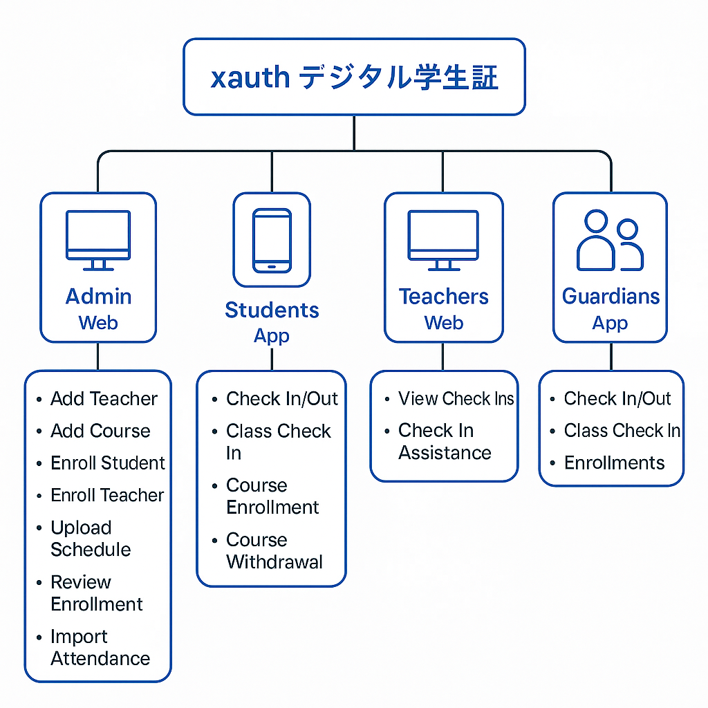

# xauth デジタル学生証

  

### 👑 1. 管理者【Web版】

**機能：**
- 教員情報の追加
- 授業情報の追加
- 学生情報の登録
- 教員情報の登録
- 時間割のアップロード
- 学生の履修申請の審査
- 出欠記録のインポート・管理

**画面設計ポイント：**
- 表（テーブル）＋フォームを中心とした設計
- CSV・Excelによる一括インポート機能
- 履修申請は承認フロー（承認待ち / 承認 / 否認）に対応

---

### 🎓 2. 学生【アプリ版】

**機能：**
- **登校・下校打刻**
- **授業出席打刻**
- 授業の履修申請（開講科目の閲覧・申請）
- 履修取消申請

**画面設計ポイント：**
- ホーム画面に本日の打刻状況（登校済み・下校済み）を表示
- 授業一覧（履修申請・履修取消可能）
- 「ワンタップ打刻」＋「打刻履歴」表示
- プッシュ通知による打刻リマインダー機能対応

---

### 🧑‍🏫 3. 教員【Web版】

**機能：**
- 自身の授業における学生の出席人数の確認
- 学生の代理打刻（補助打刻）

**画面設計ポイント：**
- 当日の授業スケジュール表示
- 出席リスト（出席した学生の一覧表示）
- 学生検索・代理打刻機能

---

### 🧑‍👧‍👦 4. 保護者【アプリ版】

**機能：**
- 子供の登校・下校・授業出席の打刻記録の閲覧
- 履修履歴の確認
- 打刻異常（未打刻時）の通知

**画面設計ポイント：**
- 子供一覧表示（複数子供の切り替え対応）
- プッシュ通知（例：本日未登校打刻通知）
- 打刻履歴検索（指定日・月ごと）

---

### 🏗️ 技術構成の提案

- **学生・保護者向けアプリ**：Flutter（iOS / Android対応）
- **管理者・教員用Webアプリ**：Vue.js
- **バックエンド**：Golang
- **認証システム（xauthコア）**：JWT + OAuth 2.0 + SMS/メール認証
- **打刻時の位置情報検証**：GPS測位 ＋ 校内Wi-Fi / Bluetoothによる認証
- **データベース**：PostgreSQL 
- **プッシュ通知**：Firebase Cloud Messaging (FCM)

