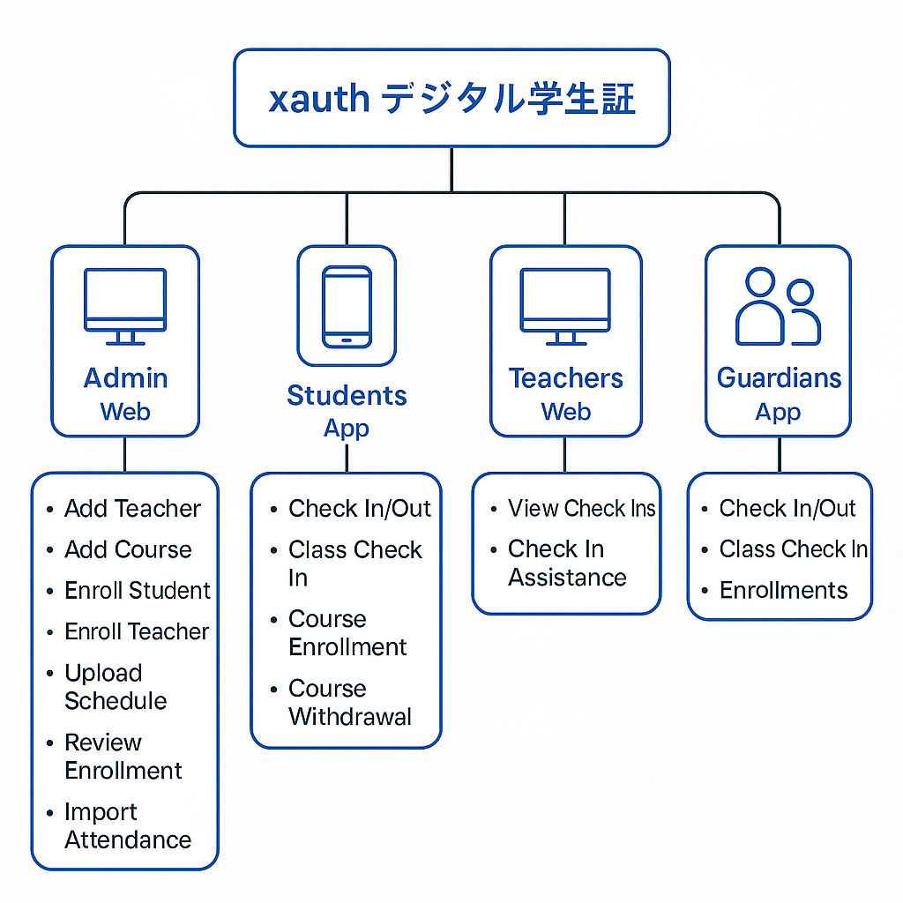

# xauth デジタル学生証

### 👑 1. Admin（管理者）【Web端】
功能：
- 添加教师信息
- 添加课程信息
- 录入学生信息
- 录入教师信息
- 上传课程表
- 审核学生选课申请
- 导入/管理考勤记录

界面设计要点：
- 以表格（Table）+ 表单（Form）为主
- 批量导入（CSV、Excel）功能
- 选课审核可以设为审批流（Pending / Approve / Reject）

---

### 🎓 2. 学生【App端】
功能：
- **入校打卡 / 退校打卡**
- **上课打卡**
- 选课申请（查看开设课程、报名）
- 退课申请

界面设计要点：
- 首页显示今日打卡状态（已入校、已退校）
- 课程列表（可以报名/退课）
- 打卡采用「一键打卡」＋「签到记录」展示
- 支持打卡提醒（Push通知）

---

### 🧑‍🏫 3. 教师【Web端】
功能：
- 查看自己课程的学生签到人数
- 帮助学生补签（代签功能）

界面设计要点：
- 查看当天课程表
- 签到列表（显示签到学生名单）
- 可以搜索、补签学生

---

### 🧑‍👧‍👦 4. 保护者（家长）【App端】
功能：
- 查看子女入校、退校、上课的打卡记录
- 选课记录查看
- 打卡异常（未打卡提醒）

界面设计要点：
- 学生一览（如果有多个孩子）
- 通知推送（比如今天未入校打卡提醒）
- 历史打卡记录查询（按日/月）

---

### 🏗️ 技术建议
- **学生端 / 家长端 App**：Flutter 开发（兼容 iOS 和 Android）
- **Web端**（Admin、教师）：Vue.js
- 后端：Golang
- 身份认证系统（xauth核心）：使用 JWT + OAuth 2.0 + 短信/邮箱验证码登录
- 打卡定位/校验：需要 GPS 定位 + 校内 WiFi/蓝牙验证
- 数据库：PostgreSQL
- 消息推送：Firebase Cloud Messaging (FCM)

好的，结合你的需求（Admin、学生、教师、家长四个角色 + 打卡/选课/退课/考勤/审核），这里给出一版基础的数据库设计方案（ER图结构思路）。

---

### ✨ 主要数据表（简化版）

| 表名 | 说明 |
|:----|:----|
| users | 存储所有用户（学生/教师/家长/管理员）基本信息 |
| students | 学生专属信息 |
| teachers | 教师专属信息 |
| guardians | 家长专属信息 |
| courses | 课程信息 |
| course_enrollments | 学生选课、退课记录 |
| schedules | 课程表（上课时间、教室） |
| attendances | 打卡记录（入校/退校/上课打卡） |
| relations | 家长与学生的关联表 |

---

### 🧱 各表字段设计细节

#### 1. `users`
| 字段 | 类型 | 说明 |
|:---|:---|:---|
| id | UUID / BIGINT | 主键 |
| name | VARCHAR | 姓名 |
| email | VARCHAR | 邮箱（登录用）|
| phone | VARCHAR | 手机号（登录用）|
| password | VARCHAR | 加密后的密码 |
| role | ENUM('admin', 'student', 'teacher', 'guardian') | 角色类型 |
| created_at | TIMESTAMP | 创建时间 |
| updated_at | TIMESTAMP | 更新时间 |

---

#### 2. `students`
| 字段 | 类型 | 说明 |
|:---|:---|:---|
| id | UUID / BIGINT | 主键，对应 `users.id` |
| student_number | VARCHAR | 学号 |
| grade | VARCHAR | 年级 |
| class | VARCHAR | 班级 |

---

#### 3. `teachers`
| 字段 | 类型 | 说明 |
|:---|:---|:---|
| id | UUID / BIGINT | 主键，对应 `users.id` |
| teacher_number | VARCHAR | 教师编号 |
| department | VARCHAR | 所属部门 |

---

#### 4. `guardians`
| 字段 | 类型 | 说明 |
|:---|:---|:---|
| id | UUID / BIGINT | 主键，对应 `users.id` |
| relation_type | VARCHAR | 与学生关系（如父亲、母亲等） |

---

#### 5. `courses`
| 字段 | 类型 | 说明 |
|:---|:---|:---|
| id | UUID / BIGINT | 课程ID |
| name | VARCHAR | 课程名 |
| description | TEXT | 课程描述 |
| teacher_id | UUID / BIGINT | 任课教师ID |
| capacity | INT | 最大学生数 |

---

#### 6. `course_enrollments`
| 字段 | 类型 | 说明 |
|:---|:---|:---|
| id | UUID / BIGINT | 主键 |
| student_id | UUID / BIGINT | 学生ID |
| course_id | UUID / BIGINT | 课程ID |
| status | ENUM('enrolled', 'withdrawn', 'pending') | 状态（报名成功、退课、待审核） |
| created_at | TIMESTAMP | 报名时间 |

---

#### 7. `schedules`
| 字段 | 类型 | 说明 |
|:---|:---|:---|
| id | UUID / BIGINT | 主键 |
| course_id | UUID / BIGINT | 课程ID |
| classroom | VARCHAR | 上课教室 |
| start_time | TIMESTAMP | 上课开始时间 |
| end_time | TIMESTAMP | 上课结束时间 |

---

#### 8. `attendances`
| 字段 | 类型 | 说明 |
|:---|:---|:---|
| id | UUID / BIGINT | 主键 |
| user_id | UUID / BIGINT | 学生ID |
| type | ENUM('entry', 'exit', 'class') | 打卡类型（入校、退校、上课签到） |
| course_id | UUID / BIGINT | 上课打卡对应的课程ID（入校/退校可以为空） |
| status | ENUM('present', 'absent', 'late') | 出勤状态 |
| timestamp | TIMESTAMP | 打卡时间 |

---

#### 9. `relations`
| 字段 | 类型 | 说明 |
|:---|:---|:---|
| id | UUID / BIGINT | 主键 |
| guardian_id | UUID / BIGINT | 家长ID |
| student_id | UUID / BIGINT | 学生ID |

---

